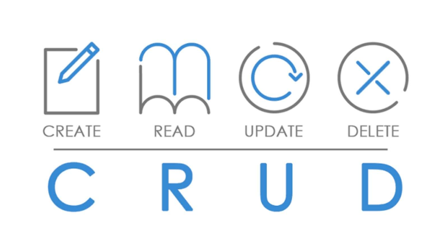

<h1 align="center"> API CRUD </h1>

Aplicação Node.js usando o framework Express para criar uma API RESTful que lida com operações CRUD

  <a href="#-tecnologias">Tecnologias</a>&nbsp;&nbsp;&nbsp;|&nbsp;&nbsp;&nbsp;
  <a href="#-projeto">Projeto</a>&nbsp;&nbsp;&nbsp;|&nbsp;&nbsp;&nbsp;
  <a href="#-layout">Layout</a>&nbsp;&nbsp;&nbsp;|&nbsp;&nbsp;&nbsp;

  

 

  

## 🚀 Tecnologias

Esse projeto foi desenvolvido com as seguintes tecnologias:

- NodeJS
- Express
- Mongoose
- MongoDB

## 💻 Projeto

Em documentos de uma coleção MongoDB chamada "Academia". Ele fornece endpoints para criar, ler, atualizar e excluir academias da coleção.

## 🔖 Layout

Você pode visualizar o layout do projeto através [DESSE LINK](https://youtu.be/1dh9gJaiJkY). Irei sempre que possivel postar alguns projetos lá! Se puder inscreva-se!

Necessário ter conta no [YOUTUBE](https://www.youtube.com/) para se inscrever!.

---

Feito com ♥ por Pedro Igor Campos Costa - Ciência da computação! :wave:
